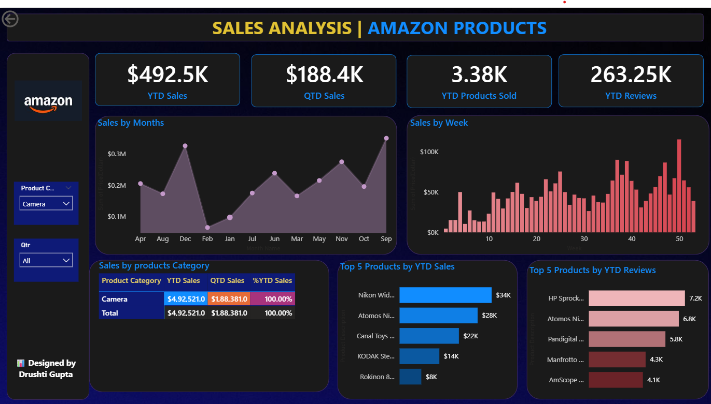

# Amazon_Data_analysis_dashboard
Amazon product sales visualized with Power BI — explore revenue trends, top categories, and key insights at a glance.

---

🔹 KPI Cards (Top Row)

* $492.5K – YTD Sales
→ Total sales so far this year.

* $188.4K – QTD Sales
→ Sales in the current quarter.

* 3.38K – YTD Products Sold
→ Number of units sold this year.

* 263.25K – YTD Reviews
→ Number of customer reviews received this year.

---
🔹 Graphs

* Sales by Months (left)
Shows monthly sales trend. Peaks in Dec & Sep, lowest in Feb.

* Sales by Week (right)
Weekly sales trend. Sales grow steadily with high spikes near the year-end.

---
🔹 Sales Breakdown

* Sales by Product Category (bottom left)
Only "Camera" category is shown.

* YTD Sales: $492.5K

* QTD Sales: $188.3K

* 100% share of sales (since filter is on Camera).
---

🔹 Top 5 Products

* By YTD Sales (middle bottom)

* Nikon Wide Lens → $34K

* Atomos Ninja → $28K

* Canal Toys → $22K

* Kodak → $14K

* Rokinon → $8K

* By YTD Reviews (bottom right)

* HP Sprocket → 7.2K reviews

* Atomos Ninja → 6.8K

* Pandigital → 5.8K

* Manfrotto → 4.3K

* AmScope → 4.1K

---

🔹 Filters (Left Sidebar)

* Product Category → Currently set to "Camera".

* Quarter (Qtr) → Can select specific quarter or All.
